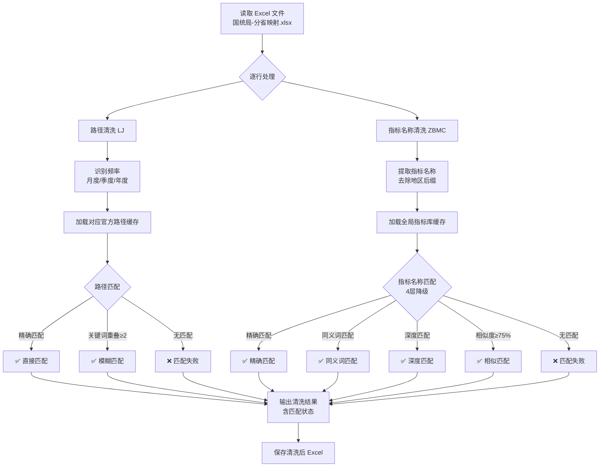

# 国统局指标名称与路径清洗引擎

## 📌 项目背景

在将国统局数据接入内部系统的过程中，面临两个核心问题：

1. **指标名称不统一**：业务系统使用的指标名称与国统局官方名称存在差异（如“商品房”vs“新建商品房”、“累计值”vs“累计”等），直接匹配失败率高
2. **路径结构不一致**：Excel 中的路径描述与国统局官方目录树结构不完全匹配，导致无法自动关联

本工具作为**国统局分省指标映射与清洗引擎**的核心模块，实现了：
- **指标名称标准化清洗**：通过同义词替换、深度匹配、相似度算法，将业务指标名称对齐到全局指标库
- **路径标准化清洗**：通过精确匹配 + 关键词模糊匹配，将路径对齐到官方目录树缓存
- **大规模批量处理**：支持 7.5 万+ 条记录的自动清洗，输出标准化字段供下游入库

## 🛠️ 技术栈

| 类别 | 工具/技术 | 用途 |
|:---|:---|:---|
| **核心语言** | Python 3.x | 主开发语言 |
| **数据处理** | OpenPyXL | Excel 读写与批量处理 |
| **文本匹配** | 正则表达式（re）、`difflib.SequenceMatcher` | 名称标准化与相似度计算 |
| **缓存系统** | JSON 文件缓存 | 存储全局指标库和官方路径树 |
| **算法设计** | 多层降级匹配（精确→同义词→深度→相似度） | 最大化匹配覆盖率 |

## 🧠 系统整体架构



### 核心数据流

| 输入 | 处理 | 输出 |
|:---|:---|:---|
| 原始 Excel（ZBDM, LJ, ZBMC） | 路径清洗 + 指标名称清洗 | 清洗后 LJ、匹配状态、官方路径；清洗后 ZBMC、匹配状态、官方名称 |

## 📥 核心功能详解

### 1. 指标名称清洗（4 层降级匹配）

```python
def match_indicator_with_index(excel_name, index):
    # 第1层：精确匹配（保留原样）
    if excel_norm in index: return "精确匹配"
    
    # 第2层：同义词匹配（商品房↔新建商品房）
    if excel_syn in index: return "同义词匹配"
    
    # 第3层：深度匹配（去除单位和括号）
    if excel_deep in index: return "深度匹配"
    
    # 第4层：相似度匹配（SequenceMatcher ≥ 75%）
    if best_ratio >= 0.75: return f"相似匹配({best_ratio:.2f})"
    
    return "匹配失败"
```

#### 同义词映射（可扩充）

```python
SYNONYM_MAP = {
    "商品房": "新建商品房",
    "累计值": "累计",
    "累计增长": "累计增长 (%)",
    "同比增长": "同比增长 (%)",
    "平均销售价格": "平均销售价格(元/平方米)",
    "人均可支配收入": "人均可支配收入(元)",
    # ... 可不断扩充
}
```

#### 深度匹配（去除干扰项）

```python
def normalize_deep(name):
    name = re.sub(r'[\(（][^\)）]*[\)）]', '', name)  # 去掉括号内容
    name = re.sub(r'[0-9]+\s*[万平方米|亿元|万元|%]+', '', name)  # 去掉单位
    name = re.sub(r'[^\u4e00-\u9fa5a-zA-Z0-9]', '', name)  # 只保留核心字符
    return name
```

### 2. 路径清洗（精确 + 模糊匹配）

#### 精确匹配
```python
def match_path(excel_path, official_paths):
    norm_excel = normalize_path(excel_path)
    for off_path in official_paths:
        if normalize_path(off_path) == norm_excel:
            return True, off_path, "精确匹配"
```

#### 模糊匹配（关键词重叠）
```python
# 提取路径关键词，计算重叠数
excel_keywords = extract_path_keywords(excel_path)
for off_path in official_paths:
    off_keywords = extract_path_keywords(off_path)
    overlap = len(excel_keywords & off_keywords)
    if overlap >= 2:
        return True, off_path, f"模糊匹配({overlap}个关键词)"
```

### 3. 索引加速

构建**多键索引**，将匹配从 O(n) 降到 O(1)：

```python
def build_enhanced_index(official_set):
    index = {}
    for off in official_set:
        index[normalize_indicator(off)] = (off, "精确匹配")
        index[apply_synonyms(normalize_indicator(off))] = (off, "同义词匹配")
        index[normalize_deep(off)] = (off, "深度匹配")
    return index  # 查找时间：O(1)
```

## 📊 处理规模

| 指标 | 数值 |
|:---|:---:|
| 总记录数 | **75,003** 条 |
| 路径匹配率 | **84.3%** |
| 指标名称匹配率 | **97.9%** |
| 输出字段数 | 6 个（含匹配状态） |

## 📈 成果与价值

### 功能特性

- ✅ **多层降级匹配**：4 层指标匹配 + 2 层路径匹配，最大化覆盖率
- ✅ **同义词引擎**：可扩充的同义词映射表，持续提升匹配准确率
- ✅ **索引加速**：构建多键哈希索引，匹配时间从 O(n) 降到 O(1)
- ✅ **批量处理**：支持 7.5 万+ 条记录一次性处理
- ✅ **匹配状态追踪**：每条记录输出匹配方式（精确/同义词/深度/相似），便于质量审计
- ✅ **与官方数据联动**：从 JSON 缓存加载全局指标库和官方路径树，保持与官方数据同步

### 匹配效果对比

| 匹配方式 | 覆盖场景 | 示例 |
|:---|:---|:---|
| 精确匹配 | 名称完全一致 | `居民消费价格指数` → `居民消费价格指数` |
| 同义词匹配 | 同义词差异 | `商品房` → `新建商品房` |
| 深度匹配 | 单位/括号差异 | `平均销售价格(元/平方米)` → `平均销售价格` |
| 相似匹配 | 微小差异/错别字 | 相似度 ≥ 75% 自动匹配 |
| 路径精确匹配 | 路径结构一致 | 官方路径完全匹配 |
| 路径模糊匹配 | 关键词重叠 ≥ 2 | 自动关联到最相似官方路径 |

## 🔗 关联工具

本工具与**国统局映射路径比对工具**构成完整的映射工作流：

```text
[国统局 API] → [映射比对工具：验证映射是否正确]
                                    ↓
                    [本工具：清洗名称和路径 → 标准化输出]
                                    ↓
                        [下游：数据入库]
```

- 📊 [国统局映射路径比对工具](国统局映射路径比对工具.md) — 验证映射关系
- 📊 [指标代码归集与交叉核查工具](指标代码归集与交叉核查工具.md) — 多文件交叉核查

## 📂 相关资源

- 📦 完整项目代码：[GitHub 仓库](https://github.com/Pukaria/python-scripts-collection/blob/main/国统局指标名称和路径清洗引擎.py)

---

*工具状态：✅ 已投产使用*
*处理规模：75,003 条记录*
*匹配率：路径 84.3% | 指标名称 97.9%*