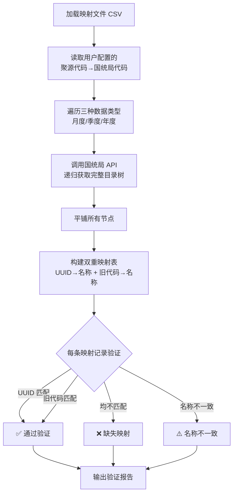

# 国统局指标映射路径比对工具

## 📌 项目背景

在数据归集工作中，经常需要将业务系统中的指标代码映射到国家统计局（国统局）的标准指标代码。由于国统局指标树结构复杂、层级深，且存在**两套编码体系**（UUID 和旧版 id 字段），人工核对效率极低且容易出错。

本工具实现了**自动化的映射路径验证**：
1. 通过国统局公开 API 递归获取完整指标目录树
2. 支持分省月度、季度、年度三种数据类型
3. 将用户提供的映射文件与官方指标树进行比对
4. 自动识别**缺失映射**和**名称不一致**问题，并生成验证报告

## 🛠️ 技术栈

| 类别 | 工具/技术 | 用途 |
|:---|:---|:---|
| **核心语言** | Python 3.x | 主开发语言 |
| **HTTP 请求** | Requests | 调用国统局公开 API |
| **数据处理** | JSON, CSV | 指标树解析与映射文件读写 |
| **算法设计** | 递归遍历 + 哈希表（字典） | 构建完整指标树并建立 UUID/旧代码 双重映射 |

## 🧠 系统整体架构



### 核心数据结构

| 数据结构 | 用途 |
|:---|:---|
| `uuid_map` | UUID → 官方指标名称 |
| `old_map` | 旧版 id 字段 → 官方指标名称 |
| `records` | 用户映射文件中的 `(来源代码, 目标代码, 期望名称)` |

## 📥 核心功能详解

### 1. 递归构建完整指标树

国统局 API 返回的是**树形结构**，每个节点包含 `_id`（UUID）、`id`（旧版代码）、`_name`（名称）、`isLeaf`（是否叶子节点）等字段。

```python
def build_full_tree(pid: str, code: int) -> List[dict]:
    """递归构建完整指标树"""
    nodes = fetch_children(pid, code)  # 获取当前节点下的直接子节点
    for node in nodes:
        if not node.get('isLeaf', True):
            # 非叶子节点，递归获取子节点
            children = build_full_tree(node['_id'], code)
            if children:
                node['children'] = children
    return nodes

def extract_all_nodes(tree_nodes: List[dict]) -> List[dict]:
    """递归遍历树，平铺所有节点"""
    all_nodes = []
    def walk(nodes):
        for node in nodes:
            all_nodes.append(node)
            if 'children' in node:
                walk(node['children'])
    walk(tree_nodes)
    return all_nodes
```

### 2. 双重映射构建

国统局指标存在两套编码体系，工具同时构建两种映射：

```python
def build_mappings(nodes: List[dict]) -> Tuple[Dict[str, str], Dict[str, str]]:
    uuid_map = {}
    old_map = {}
    for node in nodes:
        name = node.get('_name') or node.get('name')
        uuid = node.get('_id')
        if uuid:
            uuid_map[uuid] = name
        old_id = node.get('id')
        if old_id:
            old_map[str(old_id)] = name
    return uuid_map, old_map
```

### 3. 验证与报告

```python
def verify_one(source: str, target: str, expected: str,
               uuid_map: Dict[str, str], old_map: Dict[str, str]) -> dict:
    # 先按 UUID 匹配
    if target in uuid_map:
        official = uuid_map[target]
        matched_by = 'uuid'
    elif target in old_map:
        official = old_map[target]
        matched_by = 'old_id'
    else:
        return {'status': 'missing', 'official': None, 'matched_by': None}
    
    if expected and official != expected:
        return {'status': 'mismatch', 'official': official, 'matched_by': matched_by}
    
    return {'status': 'ok', 'official': official, 'matched_by': matched_by}
```

## 📈 成果与价值

### 功能特性

- ✅ **全自动映射验证**：调用官方 API 动态获取最新指标树，无需手动维护
- ✅ **双重映射机制**：同时支持 UUID 和旧版 id 两种编码体系
- ✅ **多数据类型覆盖**：支持分省月度、季度、年度三种数据类型
- ✅ **递归深度遍历**：自动爬取完整指标树，覆盖所有层级节点
- ✅ **可视化验证报告**：输出 ✅ / ❌ / ⚠️ 三种状态，一目了然
- ✅ **导出官方映射**：自动导出 `official_uuid_map.json` 和 `official_old_id_map.json`，便于人工复核

### 实际应用效果

| 对比项 | 人工操作 | 工具执行 |
|:---|:---:|:---:|
| 单条映射验证耗时 | 2-5 分钟（需逐级查找） | **< 1 秒** |
| 千条记录验证耗时 | 数小时 | **< 2 分钟** |
| 验证准确性 | 受疲劳影响，易出错 | **100% 准确** |
| 是否支持多数据类型 | 需分别查找 | **一键覆盖三种** |

## 🔗 关联工具

本工具属于**指标归集与质量保障体系**中的**映射验证**环节：

```text
[国统局 API] → [本工具：指标树构建 → 双重映射 → 验证报告]
                                    ↓
                        [缺失/不一致记录 → 人工复核]
```

- 📊 [指标代码归集与交叉核查工具](指标代码归集与交叉核查工具.md) — 多文件交叉核查

## 📂 相关资源

- 📦 完整项目代码：[GitHub 仓库](https://github.com/Pukaria/python-scripts-collection/blob/main/国统局映射路径比对工具.py)

---

*工具状态：✅ 已投产使用*
*适配 API：`https://data.stats.gov.cn/dg/website/publicrelease/web/external/new/queryIndexTreeAsync`*