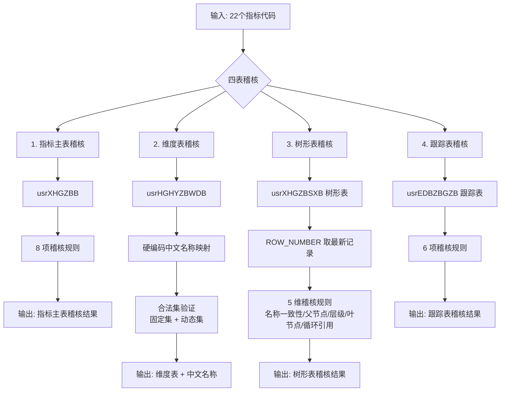

# 多指标综合稽核 SQL 脚本2

## 📌 项目背景

在日常数据质量监控中，需要对**批量指标**进行全方位的稽核检查，涵盖指标主表、维度配置、树形结构、跟踪记录等多个维度。本脚本针对 **22 个指定指标**，一次性输出 4 张稽核表，并特别强化了**维度代码中文名称映射**和**树形结构自洽性检查**。

## 🛠️ 技术栈

| 类别 | 工具/技术 | 用途 |
|:---|:---|:---|
| **数据库** | SQL Server | 生产环境数据库查询 |
| **核心语法** | CTE（公共表表达式） | 多表关联与数据预处理 |
| **窗口函数** | ROW_NUMBER() | 按分区取最新记录 |
| **表值构造器** | UNION ALL + VALUES | 维度代码→中文名称映射 |
| **变量表** | 表变量 `@TargetCodes` | 动态传入目标指标代码 |
| **高级检查** | 自关联、子树查询 | 树形结构完整性验证 |

## 🧠 系统整体架构



## 📥 核心功能详解

### 1. 指标主表稽核（8 项检查）

```sql
SELECT 
    t.ZBDM AS 指标代码,
    m.ZBMC AS 指标名称,
    m.ZBPLPL AS 披露频率,
    m.JZRQ AS 最新截止日期,
    CASE m.KFZT
        WHEN 1 THEN '开放且有效'
        WHEN 2 THEN '开放但停止更新'
        WHEN 5 THEN '待观察'
        WHEN 11 THEN '不开放但有效'
        WHEN 12 THEN '不开放且停止更新'
        ELSE CAST(m.KFZT AS VARCHAR)
    END AS 开放状态,
    CASE 
        WHEN m.ZBDM IS NULL THEN '缺失'
        WHEN m.ZBMC IS NULL OR m.ZBMC = '' THEN '指标名称为空'
        WHEN m.ZBPLPL NOT IN (1,7,14,10,30,90,180,365,999) THEN '披露频率不合法'
        WHEN m.JZRQ IS NULL THEN '最新截止日期为空'
        WHEN m.JZRQ > GETDATE() THEN '截止日期为未来'
        WHEN m.KFZT IN (2,12) THEN '指标已停更'
        WHEN m.KFZT = 5 THEN '待观察'
        ELSE '正常'
    END AS 稽核结果
```

**稽核规则说明：**

| 检查项 | 异常判定 |
|:---|:---|
| 指标是否存在 | 缺失 |
| 指标名称 | 名称为空 |
| 披露频率 | 不在合法集合中 |
| 截止日期 | 为空 或 为未来日期 |
| 开放状态 | 已停更 或 待观察 |

### 2. 维度表稽核（含中文名称映射）

#### 维度代码中文名称映射

使用 `UNION ALL` 构造硬编码映射表：

```sql
WITH CodeName AS (
    SELECT '13' AS WDLBDM, '144000000' AS WDDM, '中国' AS WDDM_NAME UNION ALL
    SELECT '11', '1108', '期末值' UNION ALL
    SELECT '11', '1103', '当期值' UNION ALL
    SELECT '12', '1203', '月' UNION ALL
    SELECT '12', '1201', '日' UNION ALL
    SELECT '12', '1209', '不定期' UNION ALL
    SELECT '59', '590002652', '逆回购' UNION ALL
    SELECT '59', '590003010', '中期借贷便利(MLF)' UNION ALL
    -- ... 可继续扩充
)
```

#### 合法集验证（固定集 + 动态集）

```sql
-- 固定合法集（区域、口径、期间、拼接顺序）
FixedValid AS (
    SELECT '13' AS WDLBDM, '144000000' AS WDDM
    UNION ALL
    SELECT '11', '1108' UNION ALL SELECT '11', '1103'
    UNION ALL
    SELECT '12', '1203' UNION ALL SELECT '12', '1201' UNION ALL SELECT '12', '1209'
    UNION ALL
    SELECT '65', '65005'
),
-- 动态合法集（原子指标、统计主体：从有效维度记录中自洽）
DynamicValid AS (
    SELECT DISTINCT WDLBDM, WDDM
    FROM DimValid
    WHERE WDLBDM IN ('61', '59')
)
```

**维度表稽核输出示例：**

| 指标代码 | 维度属性 | 维度代码 | 维度代码中文名称 | 稽核结果 | 备注 |
|:---|:---|:---|:---|:---|:---|
| 110421067 | 统计区域 | 144000000 | 中国 | 一致 | NULL |
| 110421067 | 统计口径 | 1108 | 期末值 | 一致 | NULL |
| 110421067 | 统计期间 | 1203 | 月 | 一致 | NULL |

### 3. 树形表稽核（5 维检查）

树形表是最复杂的稽核对象，包含 **5 个维度的自洽性检查**：

| 检查维度 | 检查内容 | 异常判定 |
|:---|:---|:---|
| **名称一致性** | 树形表名称与主表名称是否一致 | 名称不一致 |
| **父节点存在性** | 父节点代码是否在树形表中存在且有效 | 父节点不存在/无效 |
| **层级连续性** | 子节点深度 = 父节点深度 + 1 | 层级不连续 |
| **叶节点一致性** | 标记为叶节点但实际有子节点（或反之） | 叶节点标记错误 |
| **循环引用** | 节点是否指向自身 | 循环引用 |

#### 父节点状态检查

```sql
ParentValid AS (
    SELECT 
        tr.ZBDM,
        tr.父节点代码,
        CASE 
            WHEN tr.父节点代码 IS NULL OR tr.父节点代码 = '' OR tr.父节点代码 = '0' 
                THEN '无父节点(根节点)'
            WHEN EXISTS (SELECT 1 FROM usrXHGZBSXB p 
                         WHERE p.ZBDM = tr.父节点代码 AND p.SFYX = 1) 
                THEN '父节点存在且有效'
            WHEN EXISTS (SELECT 1 FROM usrXHGZBSXB p 
                         WHERE p.ZBDM = tr.父节点代码) 
                THEN '父节点存在但无效'
            ELSE '父节点不存在'
        END AS 父节点状态
)
```

#### 叶节点一致性检查

```sql
LeafConsistency AS (
    SELECT 
        tr.ZBDM,
        tr.是否叶节点,
        CASE 
            WHEN tr.是否叶节点 = 1 AND EXISTS (SELECT 1 FROM usrXHGZBSXB child WHERE child.FJDDM = tr.ZBDM AND child.SFYX = 1) 
                THEN '实际有子节点但标记为叶节点'
            WHEN (tr.是否叶节点 = 0 OR tr.是否叶节点 IS NULL) 
                 AND NOT EXISTS (SELECT 1 FROM usrXHGZBSXB child WHERE child.FJDDM = tr.ZBDM AND child.SFYX = 1) 
                THEN '实际无子节点但标记为非叶节点'
            ELSE '正常'
        END AS 叶节点一致性问题
)
```

### 4. 跟踪表稽核（6 项检查）

```sql
CASE 
    WHEN e.ZBDM IS NULL THEN '缺失'
    WHEN (e.LRMB IS NULL OR e.LRMB = '') AND (e.LRMBMX IS NULL OR e.LRMBMX = '') 
        THEN '模板信息为空'
    WHEN e.LRMB IS NULL OR e.LRMB = '' THEN '录入模板为空'
    WHEN e.LRMBMX IS NULL OR e.LRMBMX = '' THEN '模板明细为空'
    WHEN e.SJYSFTG = 1 THEN '数据源已停更'
    WHEN e.GKBZ != 3 THEN '未审核'
    WHEN e.XGSJ < DATEADD(YEAR, -1, GETDATE()) THEN '修改时间超过1年'
    ELSE '正常'
END AS 稽核结果
```

## 📊 输出结构

| 序号 | 输出表 | 行数 | 关键字段 |
|:---:|:---|:---:|:---|
| 1 | 指标主表稽核 | 22 行 | 指标代码、名称、频率、截止日期、开放状态、稽核结果、备注 |
| 2 | 维度表稽核 | 按实际维度数量 | 指标代码、维度属性、维度代码、**中文名称**、稽核结果、备注 |
| 3 | 树形表稽核 | 22 行 | 指标代码、主表名称、树形名称、父节点状态、层级深度、叶节点标识、稽核结果 |
| 4 | 跟踪表稽核 | 22 行 | 指标代码、录入模板、模板明细、数据源链接、公开状态、稽核结果 |

## 📈 成果与价值

### 功能特性

- ✅ **批量指标稽核**：一次查询覆盖 22 个指标的完整质量检查
- ✅ **维度中文名称映射**：硬编码业务代码→中文名称，输出更直观
- ✅ **固定+动态合法集**：区域/口径/期间使用固定枚举，原子指标/统计主体从有效数据中动态提取
- ✅ **树形表 5 维自洽性检查**：名称一致性、父节点存在性、层级连续性、叶节点一致性、循环引用
- ✅ **跟踪表 6 项检查**：模板完整性、数据源状态、审核状态、更新时间
- ✅ **精细化备注**：每条异常都有具体的修复建议

### 稽核覆盖范围

| 稽核对象 | 检查项数量 | 特色检查 |
|:---|:---:|:---|
| 指标主表 | 8 项 | 开放状态解析（含 5 种状态） |
| 维度表 | 合法集验证 | **中文名称映射 + 固定/动态联合验证** |
| 树形表 | 5 维检查 | **层级连续性 + 叶节点一致性 + 循环引用** |
| 跟踪表 | 6 项 | 修改时间超 1 年检查 |

## 🔗 关联工具

本脚本属于**数据稽核体系**中的**批量指标综合检查**工具：

```text
[22 个指标输入] → [本脚本：四表综合稽核] → [四大维度稽核报告]
```

- 📊 [指标综合稽核与维度分析 SQL 脚本](指标综合稽核与维度分析%20SQL%20脚本.md) — 单指标深度稽核
- 📊 [上交所数据自动化稽核系统](上交所数据自动化稽核系统.md) — 自动化稽核平台

## 📂 相关资源

- 📦 完整 SQL 脚本：[GitHub 仓库](https://github.com/Pukaria/python-scripts-collection/blob/main/多指标综合稽核%20SQL%20脚本2.sql)

---

*工具状态：✅ 已投产使用*
*适用场景：批量指标质量监控、维度配置核查、树形结构审计*