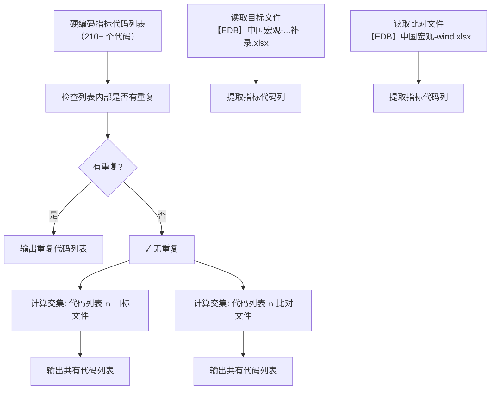

# 指标代码归集与交叉核查工具

## 📌 项目背景

在日常宏观数据运营中，经常需要面对大量指标代码的管理与核查任务。例如：业务部门提供了一个包含 **210+ 个**指标代码的清单，要求核对这些代码是否已录入到不同的 Excel 模板文件中。

传统做法是人工逐条复制粘贴、使用 Excel 的 VLOOKUP 或筛选功能逐个核对，效率极低且容易遗漏。本工具实现了**自动化的代码清单核查**，能够在几分钟内完成多文件交叉比对，并报告不一致项，为数据归集工作提供决策依据。

## 🛠️ 技术栈

| 工具 | 用途 |
|------|------|
| Python 3.x | 核心开发语言 |
| Pandas | Excel 数据读取与预处理 |
| OpenPyXL | Excel 文件引擎支持 |
| OS | 文件路径处理 |

## 🧠 核心逻辑解读

工具的核心任务是：**输入一个指标代码列表 → 自动读取多个 Excel 文件中的代码列 → 计算交集并输出结果**。

### 整体流程图



### 关键处理逻辑

| 处理环节 | 具体做法 | 业务价值 |
|:---|:---|:---|
| 内部重复检查 | 将列表转为 Set，比较长度差异 | 防止因人为手误导致清单中出现重复代码，影响统计准确性 |
| 列名自适应 | 支持 `指标代码`、`ZBDM` 等多种列名，自动识别 | 兼容不同来源的 Excel 文件，无需手动修改代码 |
| 列名类型修复 | 将列名统一转为字符串（`astype(str)`） | 修复 Pandas 读取 Excel 时可能将列名识别为 `float` 的问题 |
| 数据清洗 | 去除首尾空格、过滤空值 | 确保比对的准确性，避免因格式差异导致的漏匹配 |
| 双文件交叉比对 | 分别与“目标文件”和“比对文件”计算交集 | 快速定位哪些指标已录入、哪些尚未录入 |

## 📝 关键代码片段

```python
import pandas as pd
import os

def get_zbdm_set(file_path):
    """从 Excel 文件中提取指标代码集合，兼容多种列名"""
    if not os.path.exists(file_path):
        return set()
    
    df = pd.read_excel(file_path, engine='openpyxl')
    # 关键：将列名转为字符串，解决 float 列名问题
    df.columns = df.columns.astype(str).str.strip()
    
    # 自动识别指标代码列
    if '指标代码' in df.columns:
        col = '指标代码'
    elif 'ZBDM' in df.columns:
        col = 'ZBDM'
    else:
        # 模糊匹配
        possible = [c for c in df.columns if '指标代码' in c or 'ZBDM' in c]
        if possible:
            col = possible[0]
        else:
            return set()
    
    # 提取并清洗
    series = df[col].dropna().astype(str).str.strip()
    return set(series[series != ''])

# 检查列表内部重复
provided_set = set(codes_list)
if len(codes_list) == len(provided_set):
    print("✓ 列表中没有内部重复")

# 交叉比对
set_target = get_zbdm_set(target_file)   # 目标文件
set_compare = get_zbdm_set(compare_file) # 比对文件

common_target = provided_set.intersection(set_target)
common_compare = provided_set.intersection(set_compare)

print(f"与目标文件共有: {len(common_target)} 个")
print(f"与比对文件共有: {len(common_compare)} 个")
```

## 📈 成果与价值

- ✅ **自动去重检测**：清单内部重复检查，从源头保证数据质量
- ✅ **多文件交叉核查**：一键完成与多个 Excel 文件的代码比对，取代人工逐条 VLOOKUP
- ✅ **智能列名兼容**：自动识别 `指标代码` / `ZBDM` / 模糊匹配，适配不同格式的 Excel 文件
- ✅ **异常修复**：处理 Pandas 读取 Excel 时列名被误识别为 `float` 类型的问题
- ✅ **结果清晰可读**：输出共有的指标代码清单（按排序），方便业务人员复查

### 实际应用效果

| 对比项 | 人工操作 | 工具执行 |
|:---|:---:|:---:|
| 200+ 个代码的核查耗时 | 约 15-20 分钟 | **< 3 秒** |
| 漏检/误检风险 | 较高（人工疲劳） | **极低** |
| 是否支持多文件同时比对 | 否（需反复复制粘贴） | **是** |
| 是否需要手动处理列名差异 | 是（需调整公式） | **自动兼容** |

## 🔗 关联工具

本工具是**数据归集与质量核查流程**中的一环：

```text
[指标清单] → [交叉核查工具] → [确认录入情况] → [补录缺失指标]
```

- 📊 [宏观数据自动比对工具](宏观数据自动比对工具.md) — 两期数据差异比对
- 📊 [数据完整性核查工具](数据完整性核查与自动补全工具.md) — 按月度检查数据连续性

## 📂 相关资源

- 📦 完整项目代码：[GitHub 仓库](https://github.com/Pukaria/python-scripts-collection/blob/main/指标代码归集与交叉核查工具.py)

---

*工具状态：✅ 已投产使用*