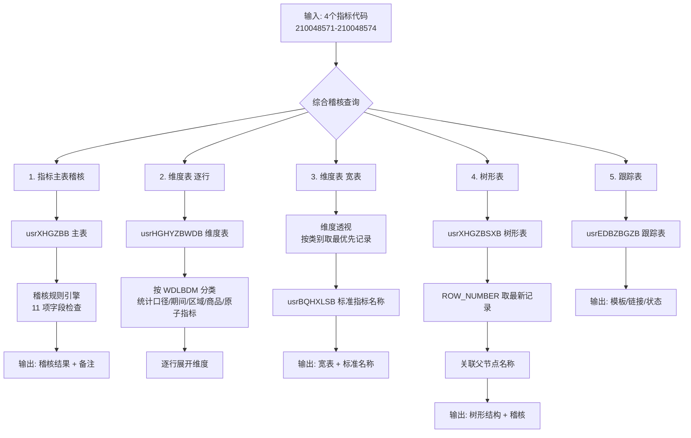

# 指标综合稽核与维度分析 SQL 脚本

## 📌 项目背景

在日常数据运营中，需要对单个指标进行**全方位的质量稽核**，涵盖指标主表信息、维度配置、树形结构、跟踪记录等多个维度。传统做法是手动查询多张表，逐个字段核对，效率低且容易遗漏。

本脚本实现了**单个指标的综合稽核查询**，一次性输出 5 张表：
1. **指标主表稽核**：检查指标名称、频率、截止日期、开放状态、数据来源等核心字段
2. **维度表（逐行）**：展示指标的所有维度配置（统计口径、期间、区域、商品分类等）
3. **维度表（宽表）**：将维度横向展开，同时关联标准指标名称
4. **树形表**：展示指标在树形结构中的位置及父节点信息
5. **跟踪表**：展示录入模板、数据源链接、所属模块等扩展信息

## 🛠️ 技术栈

| 类别 | 工具/技术 | 用途 |
|:---|:---|:---|
| **数据库** | SQL Server | 生产环境数据库查询 |
| **核心语法** | CTE（公共表表达式） | 多表关联与数据预处理 |
| **窗口函数** | ROW_NUMBER() | 按分区取最新/最优先记录 |
| **表值构造器** | VALUES 构造临时映射表 | 代码→中文名称转换 |
| **变量表** | 表变量 `@TargetCodes` | 动态传入目标指标代码 |

## 🧠 系统整体架构



## 📥 核心功能详解

### 1. 指标主表稽核（含 11 项检查）

```sql
SELECT 
    t.ZBDM AS 指标代码,
    m.ZBMC AS 指标名称,
    m.ZBPLPL AS 披露频率,
    m.JZRQ AS 最新截止日期,
    m.SJLY AS 数据来源代码,
    sm.SJLY_CN AS 数据来源中文,
    -- 稽核结果（11 项检查）
    CASE 
        WHEN m.ZBDM IS NULL THEN '缺失'
        WHEN m.ZBMC IS NULL OR m.ZBMC = '' THEN '指标名称为空'
        WHEN m.ZBPLPL NOT IN (1,7,14,10,30,90,180,365,999) THEN '披露频率不合法'
        WHEN m.JZRQ IS NULL THEN '最新截止日期为空'
        WHEN m.JZRQ > GETDATE() THEN '截止日期为未来'
        WHEN m.KFZT IN (2,12) THEN '指标已停更'
        WHEN m.KFZT = 5 THEN '待观察'
        WHEN m.SJLY IS NULL OR m.SJLY = '' THEN '数据来源为空'
        WHEN m.ZBLB IS NULL OR m.ZBLB = '' THEN '指标类别缺失'
        ELSE '正常'
    END AS 稽核结果
```

**稽核规则说明：**

| 检查项 | 规则 | 异常判定 |
|:---|:---|:---|
| 指标是否存在 | `ZBDM IS NULL` | 缺失 |
| 指标名称 | `ZBMC IS NULL OR = ''` | 名称为空 |
| 披露频率 | 必须在合法值列表 `(1,7,14,10,30,90,180,365,999)` 中 | 频率不合法 |
| 截止日期 | `JZRQ IS NULL` | 日期为空 |
| 截止日期时效 | `JZRQ > GETDATE()` | 日期为未来 |
| 开放状态 | `KFZT IN (2,12)` | 指标已停更 |
| 开放状态 | `KFZT = 5` | 待观察 |
| 数据来源 | `SJLY IS NULL OR = ''` | 来源为空 |
| 指标类别 | `ZBLB IS NULL OR = ''` | 类别缺失 |

### 2. 维度表（逐行模式）

从维度表 `usrHGHYZBWDB` 中提取指标的所有维度配置，按行展开：

```sql
WITH DimValid AS (
    SELECT 
        d.ZBDM,
        d.WDLBDM,
        d.WDDM,
        d.WDSX,
        CASE d.WDLBDM
            WHEN '11' THEN '统计口径'
            WHEN '12' THEN '统计期间'
            WHEN '13' THEN '统计区域'
            WHEN '52' THEN '商品分类'
            WHEN '59' THEN '统计主体'
            WHEN '61' THEN '原子指标类别'
            WHEN '65' THEN '拼接顺序类别'
            ELSE '其他(' + CAST(d.WDLBDM AS VARCHAR(10)) + ')'
        END AS 维度属性
    FROM usrHGHYZBWDB d
    WHERE d.ZBDM IN (SELECT ZBDM FROM @TargetCodes)
      AND d.SFYX = 1  -- 仅取有效维度
)
```

### 3. 维度表（宽表模式）

使用 `ROW_NUMBER()` 按维度类别分组，取排序最优先的记录，横向展开：

```sql
-- 每个指标每个维度类别取 WDSX 最小的一条
Dim11 AS (
    SELECT ZBDM, WDDM, ROW_NUMBER() OVER (PARTITION BY ZBDM ORDER BY WDSX) AS rn
    FROM usrHGHYZBWDB
    WHERE ZBDM IN (SELECT ZBDM FROM @TargetCodes) AND WDLBDM = '11' AND SFYX = 1
)
-- 分别处理 11, 12, 13, 52, 61 五个维度类别
-- 最终输出宽表，同时关联 usrBQHXLSB 获取标准指标名称
```

**宽表输出示例：**

| 指标代码 | 指标名称 | 标准指标名称 | 统计口径 | 统计期间 | 统计区域 | 原子指标类别 | 商品分类 |
|:---|:---|:---|:---|:---|:---|:---|:---|
| 210048571 | 出口数量:当月值 | 中国出口数量 | 当期值 | 月 | 中国 | 出口数量 | 飞机及其他航空器 |

### 4. 树形表

从树形表 `usrXHGZBSXB` 中取最新记录，关联父节点信息：

```sql
WITH TreeLatest AS (
    SELECT 
        ZBDM,
        ZBMC AS 树形指标名称,
        ZSMC AS 展示名称,
        FJDDM AS 父节点代码,
        ROW_NUMBER() OVER (PARTITION BY ZBDM ORDER BY XGSJ DESC) AS rn
    FROM usrXHGZBSXB
    WHERE ZBDM IN (SELECT ZBDM FROM @TargetCodes) AND SFYX = 1
)
SELECT 
    tr.树形指标名称,
    tr.展示名称,
    tr.父节点代码,
    p.ZBMC AS 父节点名称,  -- 关联父节点名称
    CASE 
        WHEN tr.父节点代码 IS NOT NULL AND p.ZBDM IS NULL THEN '父节点不存在或无效'
        ELSE '正常'
    END AS 稽核结果
```

### 5. 代码→中文映射（表值构造器）

使用 `VALUES` 构造临时映射表，避免硬编码：

```sql
WITH SourceMap AS (
    SELECT * FROM (VALUES
        ('1406','海关总署'), ('29878','中央国债登记结算有限公司'),
        ('29672','美国商务部经济分析局'), ('29801','中国外汇交易中心'),
        ('30603','国资委'), ('30609','财政部'),
        -- ... 30+ 个数据来源映射
    ) AS t(SJLY_Code, SJLY_CN)
)
```

## 📊 输出结构

| 序号 | 输出表 | 用途 | 关键字段 |
|:---:|:---|:---|:---|
| 1 | 指标主表稽核 | 核心字段质量检查 | 稽核结果、备注、修改信息 |
| 2 | 维度表（逐行） | 查看全部维度配置 | 维度属性、维度代码、中文名称 |
| 3 | 维度表（宽表） | 横向查看维度组合 | 统计口径、期间、区域、标准名称 |
| 4 | 树形表 | 查看树形结构位置 | 树形名称、展示名称、父节点、叶节点标识 |
| 5 | 跟踪表 | 查看录入与发布信息 | 录入模板、数据源链接、公开状态 |

## 📈 成果与价值

### 功能特性

- ✅ **单脚本五表输出**：一次查询覆盖指标的全部关联信息
- ✅ **11 项自动稽核规则**：自动识别指标主表的异常数据
- ✅ **维度宽表转换**：将多行维度数据横向展开，便于查看
- ✅ **父节点递归关联**：树形表中自动关联父节点名称
- ✅ **代码映射解耦**：通过 CTE + VALUES 实现代码→中文的动态转换
- ✅ **窗口函数精准取数**：`ROW_NUMBER()` 保证取到最新/最优先记录

### 稽核覆盖面

| 稽核对象 | 检查项数量 |
|:---|:---:|
| 指标主表 | 11 项 |
| 树形表 | 4 项 |
| 跟踪表 | 2 项 |
| 维度表 | 有效性过滤 + 中文映射 |
| 父节点关联 | 存在性校验 |

## 🔗 关联工具

本脚本属于**数据稽核体系**中的**单指标综合查询**工具：

```text
[指标代码输入] → [本脚本：五表综合查询] → [稽核报告 + 维度详情 + 树形结构]
```

- 📊 [上交所数据自动化稽核系统](上交所数据自动化稽核系统.md) — 自动化稽核平台
- 📊 [宏观数据自动比对工具](宏观数据自动比对工具.md) — 两期数据比对

## 📂 相关资源

- 📦 完整 SQL 脚本：[GitHub 仓库](https://github.com/Pukaria/python-scripts-collection/blob/main/指标综合稽核与维度分析%20SQL%20脚本.sql)

---

*工具状态：✅ 已投产使用*
*适用场景：日常指标质量监控、维度配置核查、树形结构审计*