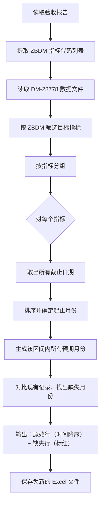

# 数据完整性核查与自动补全工具

## 📌 项目背景

在日常数据运营中，常常需要核对某个指标集是否按预期频率（如每月）完整上报。原始数据文件 `DM-28778.xlsx` 包含了大量指标的截止日期记录，但存在部分月份数据缺失的情况。

传统做法是人工逐月核对，效率极低且容易遗漏。本工具实现了**自动化的数据完整性核查**：
1. 从验收报告中读取**应上报的指标列表**
2. 对每个指标，检查其**实际存在的月份记录**是否连续
3. 自动**补全缺失的月份行**，并用红色高亮标记，便于业务人员快速定位问题

## 🛠️ 技术栈

| 工具 | 用途 |
|------|------|
| Python 3.x | 核心开发语言 |
| Pandas | 数据读取、筛选、分组与处理 |
| OpenPyXL | Excel 读写、样式复制与格式保留 |
| dateutil.relativedelta | 月份增量计算（精准处理跨年/闰月） |

## 🧠 核心逻辑解读

工具的核心任务是 **“从验收报告取指标 → 对每个指标按月检查连续性 → 补全缺失行并标红”**。

### 整体流程图



### 关键规则说明

| 处理环节 | 具体逻辑 | 业务含义 |
|:---|:---|:---|
| 指标筛选 | 只处理验收报告中列出的 `ZBDM` | 确保只关注当前批次验收范围内的指标 |
| 连续性检查 | 按月检查，从最早月份到最晚月份，逐月判断是否存在记录 | 一个指标每月应有且仅有一条记录 |
| 缺失标记 | 缺失月份行仅填充“截止日期”列，其他列留空，背景标红 | 一目了然看出哪些月份数据缺失 |
| 排序规则 | 先按指标代码升序，再按截止日期降序 | 同类指标最新的记录排在最前面 |

## 📝 关键代码片段

```python
import pandas as pd
import openpyxl
from openpyxl.styles import PatternFill
from dateutil.relativedelta import relativedelta

# 1. 从验收报告读取目标指标列表
def get_indicator_codes_from_report(report_path):
    df = pd.read_excel(report_path, engine='openpyxl')
    codes = df['ZBDM'].astype(str).dropna().unique().tolist()
    return codes

# 2. 对每个指标检查月份连续性
for indicator, rows in groups.items():
    # 获取所有有效日期并排序
    valid_dates = sorted([r['deadline'] for r in rows if pd.notna(r['deadline'])])
    
    # 生成预期月份列表（从最早到最晚）
    start_date = valid_dates[0].replace(day=1)
    end_date = valid_dates[-1].replace(day=1)
    expected = []
    current = start_date
    while current <= end_date:
        expected.append(current)
        current += relativedelta(months=1)
    
    # 找出缺失月份
    existing = {d.replace(day=1) for d in valid_dates}
    missing = [d for d in expected if d not in existing]
    
    # 缺失行：用红色填充标记
    if missing:
        red_fill = PatternFill(start_color="FF0000", end_color="FF0000", fill_type="solid")
        # 写入缺失行，仅填充截止日期列，背景标红
```

## 📈 成果与价值

- ✅ **自动化完整性核查**：从验收报告动态读取指标列表，无需手动维护，适应不同批次
- ✅ **精准缺失检测**：按月粒度检查连续性，自动识别漏报月份
- ✅ **可视化标记**：缺失行用红色背景高亮，业务人员可直接定位问题
- ✅ **保留原始格式**：复制原单元格的字体、边框、对齐方式等样式，输出文件专业可用
- ✅ **大文件优化**：处理 5 万+ 行数据时，每 5000 行输出一次进度，避免卡顿焦虑
- ✅ **智能排序**：先按指标分组，再按截止日期降序，同一指标的最新记录一目了然

### 实际应用效果

| 指标 | 处理前 | 处理后 |
|:---|:---|:---|
| 覆盖指标数 | 根据验收报告动态确定 | 同左 |
| 数据行排序 | 无序（原始顺序） | 按指标→按日期降序 |
| 缺失检测 | 人工核对，耗时 30+ 分钟 | 自动完成，< 30 秒 |
| 缺失标记 | 无 | 红色高亮，一目了然 |

## 🔗 关联工具

本工具是**数据质量保障流程**中的一环：

```text
[验收报告] + [原始数据] → [完整性核查工具] → [标注缺失的高质量数据]
```

- 📊 [宏观数据自动比对工具](宏观数据自动比对工具.md) — 两期数据差异比对
- 📊 [宏观数据智能标注工具](宏观数据比对结果智能预处理工具.md) — 基于规则自动填充审核备注

## 📂 相关资源

- 📦 完整项目代码：[GitHub 仓库](https://github.com/Pukaria/python-scripts-collection/blob/main/数据完整性核查与自动补全工具.py)（请确认文件名与实际一致）

---

*工具状态：✅ 已投产使用*