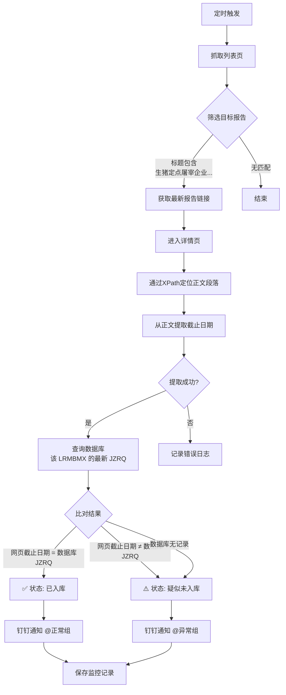

# 生猪及猪肉价格周报时效监控系统

## 📌 项目背景

农业农村部畜牧兽医局每周定期发布《生猪定点屠宰企业生猪收购和白条肉出厂价格情况》周报，是**生猪市场价格监测**的核心数据来源。该报告与《畜产品和饲料集贸市场价格情况》共同构成了**农林牧渔板块的两大核心周报**，分别从不同维度反映畜牧业市场动态。

在内部数据流程中，该报告同样面临发布时间不固定、录入环节存在延迟等问题。业务人员需要**同时监控两份周报**，手动操作繁琐且易遗漏。

本系统作为 **“农林牧渔双周报监控体系”** 的第二支柱，实现了：
1. 定时抓取指定网站，筛选目标报告（标题包含“生猪定点屠宰企业生猪收购和白条肉出厂价格情况”）
2. 从报告正文中**智能提取截止日期**（支持范围日期，如“2026年6月2—8日”取结束日）
3. 与数据库中该业务线（LRMBMX）的最新 `JZRQ` 进行比对
4. 根据比对结果，通过钉钉**双轨道精准通知**（正常@采集人员，异常@管理负责人）

## 🛠️ 技术栈

| 类别 | 工具/技术 | 用途 |
|:---|:---|:---|
| **核心语言** | Python 3.x | 主开发语言 |
| **网页抓取** | Requests + lxml | HTTP 请求与 XPath 解析 |
| **日期提取** | 正则表达式（re） | 支持范围日期（X月X—X日）和标准日期（XXXX年X月X日） |
| **数据库** | PyODBC + SQL Server | 查询业务线最新截止日期 |
| **通知系统** | 钉钉机器人 Webhook（加签模式） | 双轨道精准通知 |
| **部署** | PyInstaller | 打包为独立 .exe 可执行文件 |

## 🧠 系统整体架构



### 与畜产品周报监控的对比

| 对比项 | 畜产品周报监控 | 生猪周报监控 |
|:---|:---|:---|
| **LRMBMX** | `NEW-W1-农林牧渔-畜产品-1(周二)` | `NEW-W1-农林牧渔-生猪及猪肉价格` |
| **目标报告** | 畜产品和饲料集贸市场价格情况 | 生猪定点屠宰企业生猪收购和白条肉出厂价格情况 |
| **排除关键词** | 生猪定点屠宰企业 | 无 |
| **日期提取方式** | 正则匹配（3层降级） | XPath定位 + 正则（支持范围日期） |
| **日期格式示例** | “采集日为6月4日” | “2026年6月2—8日”取8日 |

## 📥 核心功能详解

### 1. 智能日期提取（XPath定位 + 范围日期支持）

与畜产品监控不同，生猪报告正文结构更加规整，采用 **XPath 精准定位 + 正则提取** 的组合方式：

```python
def extract_deadline_from_detail_page(url):
    tree = html.fromstring(resp.text)
    # 定位正文段落（两种XPath兜底）
    p_elements = tree.xpath('/html/body/div[3]/div/div[2]/div/p')
    if not p_elements:
        p_elements = tree.xpath('//div[@class="TRS_Editor"]/p')
    
    full_text = ' '.join([p.text_content().strip() for p in p_elements])
    
    # 优先匹配范围日期: "2026年6月2—8日" → 取结束日 8 日
    range_match = re.search(r'(\d+)年(\d+)月(\d+)[—\-](\d+)日', full_text)
    if range_match:
        year, month, start_day, end_day = range_match.groups()
        return f"{year}-{month.zfill(2)}-{end_day.zfill(2)}"
    
    # 降级匹配单个日期: "2026年6月4日"
    single_match = re.search(r'(\d{4})年(\d{1,2})月(\d{1,2})日', full_text)
    if single_match:
        year, month, day = single_match.groups()
        return f"{year}-{month.zfill(2)}-{day.zfill(2)}"
```

**范围日期处理逻辑**：报告正文中常出现“2026年6月2—8日”的表述，表示该周报覆盖6月2日至8日的数据，**系统自动取结束日（8日）作为截止日期**，与数据库 JZRQ 的语义保持一致。

### 2. 双轨道钉钉通知（与畜产品监控共用配置）

两个监控程序共用同一个钉钉机器人，通过 `LRMBMX` 标识区分业务线：

| 比对结果 | 钉钉消息标题 | @人员 | 业务含义 |
|:---|:---|:---|:---|
| 网页日期 = 数据库 JZRQ | ✅ `{LRMBMX} 数据已入库` | `18039726681` | 数据已正常入库 |
| 网页日期 ≠ 数据库 JZRQ | ⚠️ `{LRMBMX} 数据疑似未入库` | `13624296576` | 数据未入库，需跟进 |

## 📝 关键代码片段

### 数据库查询（三表联查）

```python
def get_latest_jzrq_by_lrmbmx(self, lrmbmx):
    query = """
        SELECT TOP 1 CONVERT(varchar(10), A.JZRQ, 23) AS JZRQ
        FROM usrHYSJB A
        JOIN usrEDBZBGZB B ON A.ZBDM = B.ZBDM
        JOIN usrHYZBB C ON B.ZBDM = C.ZBDM AND A.JZRQ = C.JZRQ
        WHERE B.LRMBMX = ?
        ORDER BY A.JZRQ DESC
    """
    cursor.execute(query, (lrmbmx,))
    row = cursor.fetchone()
    return row[0] if row and row[0] else None
```

### 比对逻辑（与畜产品监控一致）

```python
if db_jzrq is None:
    status_display = "疑似未入库"
    error_msg = "数据库中无该LRMBMX的记录，请检查配置。"
elif web_deadline == db_jzrq:
    status_display = "已入库"
    error_msg = ""
else:
    status_display = "疑似未入库"
    if web_deadline > db_jzrq:
        error_msg = "网页最新数据发布需要新增入库。"
    else:
        error_msg = "网页最新数据截止日期小于数据库，数据异常。"
```

## 📈 成果与价值

### 效率提升

| 对比项 | 人工操作 | 系统执行 | 提升幅度 |
|:---|:---:|:---:|:---|
| 每日监控耗时 | 10-15 分钟 | **< 1 分钟** | **95%+** |
| 双重周报监控 | 需分别手动检查 | **两套系统并行运行** | 完全自动化 |
| 范围日期处理 | 人工判断取结束日 | **自动取结束日** | 零人工干预 |
| 异常发现时效 | 延迟 1-3 天 | **报告发布后立即发现** | **实时** |

### 系统特性

- ✅ **全自动化**：定时触发，无需人工干预
- ✅ **智能范围日期提取**：支持“X月Y—Z日”格式，自动取结束日
- ✅ **双周报并行监控**：与畜产品监控共同覆盖农林牧渔核心周报
- ✅ **双轨道精准通知**：正常/异常分别@对应人员
- ✅ **生产级数据库集成**：三表联查，获取指定 LRMBMX 的最新 JZRQ
- ✅ **完整的异常处理**：任何阶段失败都有日志记录 + 钉钉告警
- ✅ **文件存档**：每次运行的原始数据、比对结果、监控记录全部留存

## 🔗 关联工具

本系统属于 **“农林牧渔双周报监控体系”** 的第二支柱：

```text
┌─────────────────────────────────────────────────────────────┐
│              农林牧渔双周报监控体系                          │
├─────────────────────────────────────────────────────────────┤
│  📊 监控一 │ 畜产品周报时效监控系统                         │
│             │ LRMBMX: NEW-W1-农林牧渔-畜产品-1(周二)       │
│  📊 监控二 │ 生猪及猪肉价格周报时效监控系统  ← 本系统      │
│             │ LRMBMX: NEW-W1-农林牧渔-生猪及猪肉价格        │
└─────────────────────────────────────────────────────────────┘
```

## 📂 相关资源

- 📦 完整项目代码：[GitHub 仓库](https://github.com/Pukaria/python-scripts-collection/blob/main/NEW-W1-农林牧渔-生猪及猪肉价格周报.py)

---

*系统状态：✅ 已投产使用，每周定时执行*
*作者：吴代奎（Wudk）*
*业务标识：`LRMBMX = NEW-W1-农林牧渔-生猪及猪肉价格`*