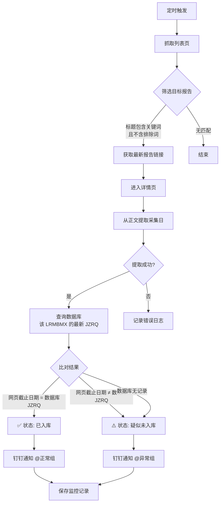

# 畜产品周报时效监控系统

## 📌 项目背景

农业农村部畜牧兽医局每周二发布《畜产品和饲料集贸市场价格情况》报告。在内部数据流程中，该报告需要被**及时采集并录入数据库**，供后续分析使用。

然而，由于报告发布时间不固定（有时周二发布，有时延迟至周三），且录入环节存在人为延迟，业务人员无法实时掌握数据是否已入库，经常需要**反复手动刷新网页和数据库**，造成大量无效工作。

本系统实现了**自动化的数据时效监控**：
1. 定时抓取指定网站，筛选目标报告（标题包含“畜产品和饲料集贸市场价格情况”且不含“生猪定点屠宰企业”）
2. 从报告正文中**智能提取采集日（截止日期）**
3. 与数据库中该业务线（LRMBMX）的最新 `JZRQ` 进行比对
4. 根据比对结果，通过钉钉**精准通知不同人员**：正常时@数据采集人员，异常时@数据管理负责人

## 🛠️ 技术栈

| 类别 | 工具/技术 | 用途 |
|:---|:---|:---|
| **核心语言** | Python 3.x | 主开发语言 |
| **网页抓取** | Requests + lxml | HTTP 请求与 XPath 解析 |
| **日期提取** | 正则表达式（re） | 从正文中智能提取采集日 |
| **数据库** | PyODBC + SQL Server | 查询业务线最新截止日期 |
| **通知系统** | 钉钉机器人 Webhook（加签模式） | 双轨道精准通知（正常/异常分别@不同人员） |
| **日期处理** | datetime | 日期计算与格式化 |
| **部署** | PyInstaller | 打包为独立 .exe 可执行文件 |

## 🧠 系统整体架构



### 核心业务流程

| 步骤 | 操作 | 输出 |
|:---|:---|:---|
| 1 | 访问列表页，筛选目标报告 | 最新报告的标题、发布日期、详情页链接 |
| 2 | 进入详情页，提取正文中的“采集日” | 格式化的日期字符串（如 `2026-06-04`） |
| 3 | 查询数据库，获取该 LRMBMX 的最新 JZRQ | 日期字符串或空值 |
| 4 | 比对两个日期 | 比对结果 |
| 5 | 发送钉钉通知 + 保存文件 | 通知已发送，文件已存档 |

## 📥 核心功能详解

### 1. 智能日期提取（从正文中采集）

报告正文中的采集日格式不固定，系统支持多种匹配模式：

```python
# 模式1: “采集日为X月X日” 或 “采集日X月X日”
collect_match = re.search(r'采集日为?(\d+)月(\d+)日', full_text)

# 模式2: “X月Y—Z日”（范围日期，取结束日）
range_match = re.search(r'(\d+)月(\d+)[—\-](\d+)日', full_text)

# 模式3: “XXXX年X月X日”（标准格式）
single_match = re.search(r'(\d{4})年(\d{1,2})月(\d{1,2})日', full_text)
```

**年份自适应逻辑**：由于报告中通常不写年份（如“6月4日”），系统根据当前日期自动判断所属年份，如果采集日明显晚于当前日期（如12月采集、1月发布），则自动减去一年。

### 2. 双轨道钉钉通知（精准分责）

系统根据比对结果，**@不同的人员组合**，实现精准通知：

| 比对结果 | 钉钉消息标题 | @人员 | 业务含义 |
|:---|:---|:---|:---|
| 网页日期 = 数据库 JZRQ | ✅ `{LRMBMX} 数据已入库` | `18039726681`（数据采集人员） | 数据已正常入库，确认即可 |
| 网页日期 ≠ 数据库 JZRQ | ⚠️ `{LRMBMX} 数据疑似未入库` | `13624296576`（数据管理负责人） | 数据未入库，需跟进处理 |
| 数据库无记录 | ⚠️ `{LRMBMX} 数据疑似未入库` | `13624296576`（数据管理负责人） | 业务线配置可能有问题 |

**通知模板示例**：

```markdown
## ⚠️ NEW-W1-农林牧渔-畜产品-1 数据疑似未入库

### 🔑 关键标识（LRMBMX）
> **`NEW-W1-农林牧渔-畜产品-1(周二)`**

### 📊 最新期比对
| 数据源 | 截止日期(采集日) | 发布时间 |
|--------|------------------|----------|
| 网页最新期 | **2026-06-04** | 2026-06-04 09:30 |
| 数据库最新期 | **2026-05-28** | NEW-W1-农林牧渔-畜产品-1(周二) |

### ⚡ 问题详情
- **监控状态**: 疑似未入库
- 网页最新数据发布需要新增入库。
```

### 3. 完整的日志与文件存档

系统每次运行都会保存以下文件：

| 文件类型 | 路径 | 内容 |
|:---|:---|:---|
| 原始列表 | `原始文件/` | 抓取到的报告列表 |
| 比对结果 | `比对结果文件/` | 网页与数据库的比对摘要 |
| 监控记录 | `{程序名}_监控/` | 每次运行的完整记录（含时间戳） |
| 运行日志 | `{程序名}_监控/` | 详细的执行日志（DEBUG/INFO/ERROR） |

## 📝 关键代码片段

### 日期提取核心逻辑

```python
def extract_deadline_from_detail_page(url):
    """从详情页正文中提取采集日，例如'采集日为6月4日' → 2026-06-04"""
    resp = requests.get(url, headers=headers, timeout=15)
    tree = html.fromstring(resp.text)
    
    # 定位正文区域
    content_div = tree.xpath('/html/body/div[3]/div/div[2]/div')
    if not content_div:
        content_div = tree.xpath('//div[@class="TRS_Editor"]')
    
    full_text = content_div[0].text_content().strip()
    
    # 匹配 "采集日为X月X日"
    collect_match = re.search(r'采集日为?(\d+)月(\d+)日', full_text)
    if collect_match:
        month, day = int(collect_match.group(1)), int(collect_match.group(2))
        year = datetime.now().year
        # 处理跨年情况（如12月采集，1月发布）
        if datetime(year, month, day) > datetime.now():
            year -= 1
        return f"{year}-{month:02d}-{day:02d}"
    
    # 降级匹配其他格式...
    return None
```

### 数据库查询（含空值处理）

```python
def get_latest_jzrq_by_lrmbmx(self, lrmbmx):
    query = """
        SELECT TOP 1 CONVERT(varchar(10), A.JZRQ, 23) AS JZRQ
        FROM usrHYSJB A
        JOIN usrEDBZBGZB B ON A.ZBDM = B.ZBDM
        JOIN usrHYZBB C ON B.ZBDM = C.ZBDM AND A.JZRQ = C.JZRQ
        WHERE B.LRMBMX = ?
        ORDER BY A.JZRQ DESC
    """
    cursor.execute(query, (lrmbmx,))
    row = cursor.fetchone()
    return row[0] if row and row[0] else None  # 无记录时返回 None
```

### 比对逻辑

```python
if db_jzrq is None:
    status_display = "疑似未入库"
    error_msg = "数据库中无该LRMBMX的记录，请检查配置。"
elif web_deadline == db_jzrq:
    status_display = "已入库"
    error_msg = ""
else:
    status_display = "疑似未入库"
    if web_deadline > db_jzrq:
        error_msg = "网页最新数据发布需要新增入库。"
    else:
        error_msg = "网页最新数据截止日期小于数据库，数据异常。"
```

## 📈 成果与价值

### 效率提升

| 对比项 | 人工操作 | 系统执行 | 提升幅度 |
|:---|:---:|:---:|:---|
| 每日监控耗时 | 15-20 分钟 | **< 1 分钟** | **95%+** |
| 是否需要手动刷新网页 | 是（反复） | **否** | 完全自动化 |
| 是否需要手动查询数据库 | 是 | **否** | 完全自动化 |
| 异常发现时效 | 业务人员主动发现，延迟 1-3 天 | **报告发布后立即发现** | **实时** |
| 通知精准度 | 群内无差别通知 | **按问题类型@对应人员** | 避免信息干扰 |

### 系统特性

- ✅ **全自动化**：定时触发，无需人工干预
- ✅ **智能日期提取**：支持多种正文日期格式（含跨年处理）
- ✅ **双轨道精准通知**：正常与异常分别@不同人员，避免信息疲劳
- ✅ **生产级数据库集成**：三表联查，获取指定 LRMBMX 的最新 JZRQ
- ✅ **完整的异常处理**：任何阶段失败都有日志记录 + 钉钉告警
- ✅ **文件存档**：每次运行的原始数据、比对结果、监控记录全部留存

## 🔗 关联工具

本系统属于**数据质量保障体系**中的**时效监控**维度：

```text
┌─────────────────────────────────────────────────────────┐
│                  数据质量保障体系                        │
├─────────────────────────────────────────────────────────┤
│  📊 时效监控 │ 畜产品周报时效监控系统                    │
│  📊 数据比对 │ 宏观数据自动比对工具                      │
│  📊 完整性   │ 数据完整性核查工具                        │
│  📊 归集核查 │ 指标代码归集核查工具                      │
│  🔄 自动化   │ 上交所/深交所自动化稽核系统               │
└─────────────────────────────────────────────────────────┘
```

- 📊 [上交所自动化稽核系统](上交所数据自动化稽核系统.md)
- 📊 [宏观数据自动比对工具](宏观数据自动比对工具.md)
- 📊 [数据完整性核查工具](数据完整性核查与自动补全工具.md)

## 📂 相关资源

- 📦 完整项目代码：[GitHub 仓库](https://github.com/Pukaria/python-scripts-collection/blob/main/NEW-W1-农林牧渔-畜产品-1.py)

---

*系统状态：✅ 已投产使用，每周二定时执行*
*作者：吴代奎（Wudk）*
*业务标识：`LRMBMX = NEW-W1-农林牧渔-畜产品-1(周二)`*